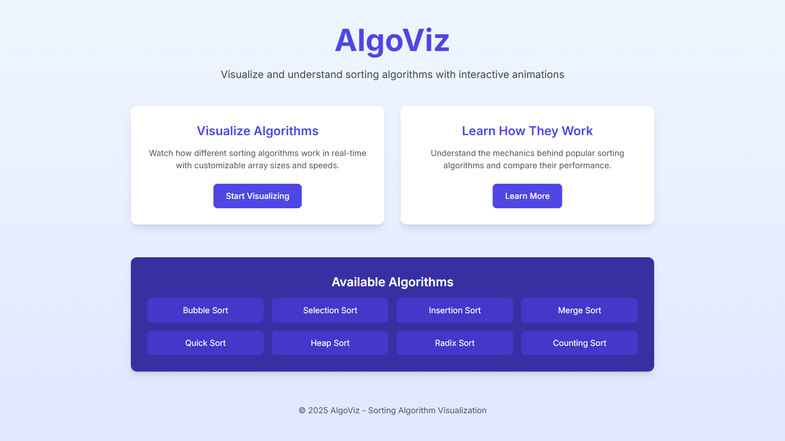

# AlgoViz - Sorting Algorithm Visualizer

AlgoViz is an interactive web application that visualizes various sorting algorithms to help users understand how they work. Built with Next.js and Tailwind CSS, this application provides a modern and intuitive interface for exploring sorting algorithms.



## Features

- **Interactive Visualization**: Watch sorting algorithms in action with customizable array sizes and speeds
- **Multiple Algorithms**: Visualize and compare different sorting algorithms:
  - Bubble Sort
  - Selection Sort
  - Insertion Sort
  - Merge Sort
  - Quick Sort
  - And more!
- **Educational Content**: Learn about the time and space complexity of each algorithm
- **Responsive Design**: Works on desktop and mobile devices

## Getting Started

### Prerequisites

- Node.js (v14.0.0 or later)
- npm (v6.0.0 or later)

### Installation

1. Clone the repository:
   ```bash
   git clone https://github.com/yourusername/algoviz.git
   cd algoviz
   ```

2. Install dependencies:
   ```bash
   npm install
   ```

3. Start the development server:
   ```bash
   npm run dev
   ```

4. Open your browser and navigate to `http://localhost:3000`

## Usage

1. **Home Page**: Navigate to different sections of the application
2. **Visualizer**: Select an algorithm, adjust the array size and speed, then click "Start Sorting" to see the algorithm in action
3. **Learn**: Read about different sorting algorithms and their characteristics

## Technologies Used

- **Next.js**: React framework for server-rendered applications
- **TypeScript**: For type safety and better developer experience
- **Tailwind CSS**: For responsive and modern UI design
- **React Hooks**: For state management and side effects

## Project Structure

```
algoviz/
├── src/
│   ├── app/
│   │   ├── page.tsx            # Home page
│   │   ├── layout.tsx          # Root layout
│   │   ├── globals.css         # Global styles
│   │   ├── visualizer/         # Sorting visualizer
│   │   │   └── page.tsx        # Visualizer component
│   │   └── learn/              # Educational content
│   │       └── page.tsx        # Learn component
│   └── components/             # Reusable components
├── public/                     # Static assets
├── package.json                # Project dependencies
├── tailwind.config.js          # Tailwind CSS configuration
└── README.md                   # Project documentation
```

## Contributing

Contributions are welcome! Please feel free to submit a Pull Request.

1. Fork the project
2. Create your feature branch (`git checkout -b feature/amazing-feature`)
3. Commit your changes (`git commit -m 'Add some amazing feature'`)
4. Push to the branch (`git push origin feature/amazing-feature`)
5. Open a Pull Request

## License

This project is licensed under the MIT License - see the LICENSE file for details.

## Acknowledgements

- Inspiration from various sorting algorithm visualizers
- Next.js documentation
- Tailwind CSS documentation
